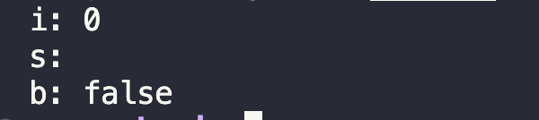
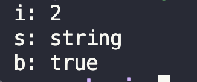
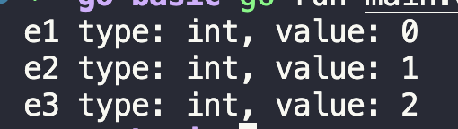

# Go: Basic Concept

## Table of Contents

## Basic Syntex

### Variable Declaration

เนื่องจาก Go เป็นภาษาโปรแกรมมิ่งแบบ ( Strongly Typed Progaming Langauage ) การประกาศตัวแปรจึงมีความสำคัญมาก Go มีการประกาศตัวแปรออกเป็น 4 แบบหลักได้แก่

#### Declare Type

เป็นการประกาศ Type ตอนที่สร้างตัวแปรขึ้นมาในโปรแกรม

```go
package main

import "fmt"

func main() {
	var i int
	var s string
	var b bool

	fmt.Println("i:", i)
	fmt.Println("s:", s)
	fmt.Println("b:", b)
}
```

หรือ

```go
package main

import "fmt"

func main() {
	var i int = 1
	var s string = ""
	var b bool = false

	fmt.Println("i:", i)
	fmt.Println("s:", s)
	fmt.Println("b:", b)
}
```

ผลลัพธ์



> ค่าตั้งต้นของตัวแปรแต่ล่ะประเภทของ Go มีดังนี้
>
> - int: 0
> - float: 0
> - string: "" (Empty String)
> - Other (Pointer Variable): nil

#### ⭐⭐⭐ Type Inference ⭐⭐⭐

การประกาศตัวแปรแบบนี้ จะทำการ ใช้ `:=` และเอา `var` กับ `variable type` ออก

โดยทั่วไปนิยมประกาศตัวแปรแบบ

```go
package main

import "fmt"

test := 2 //  ❌❌ stop it ❌❌

func main() {
	i := 2
	s := "string"
	b := true

	fmt.Println("i:", i)
	fmt.Println("s:", s)
	fmt.Println("b:", b)
}
```

ผลลัพธ์



> การประกาศแบบ Inter Type เป็นที่นิยมของ Gopher

> การประกาสแบบ Infer Type ในใช้เฉพาะใน Function เท่านั้น

#### Constant Variable

การประกาศตัวแปรคงที่ ( Constant Variable ) ทำได้โดย ใช้ Keyword `const` นำหน้าตตัวแปร และไม่สามารถใช้ `:=` ประกาศตัวแปรคงที่ได้

```go
package main

import "fmt"

const c2 := 1 //  ❌❌ stop it ❌❌
const c1 int = 1

func main() {
	const c2 = 2

	fmt.Println("c1:", c1)
	fmt.Println("c2:", c2)
}
```

การประกาศตัวแปร Constant ของ Go มีสิ่งที่้เรีบกว่า `iota` ซึ่งช่วยให้การประกาศตัวแปร Constant ทำได้ง่ายขึ้น

```go
package main

import "fmt"

const (
	e1 = iota
	e2
	e3
)

func main() {
	fmt.Printf("e1 type: %T, value: %d \n", e1, e1)
	fmt.Printf("e2 type: %T, value: %d \n", e2, e2)
	fmt.Printf("e3 type: %T, value: %d \n", e3, e3)
}

```

ผลลัพธ์



จะเห็นว่า e1 e2 และ e3 มี Type เป็น `int` แสดงว่า `iota` มี Type เป็น `int` ด้วยเช่นกัน การใช้่ iota เหมาะกับการใช้กับค่า Constant ทีมีการเรียงลำดับ สามารถดู Usecase เพิ่มเติมได้จาลงค์ด้านล่าง

[usecase](https://www.gopherguides.com/articles/how-to-use-iota-in-golang)

#### Function Declaration

ในการประกาสชื่อ function ของ Go ใช้ Key Word ว่า `func` มีรูปบบการประกาศ 3 แบบ ได้แก่

1. No Return Function:

```go
func scream(w string) {
	fmt.Printf("I wanna scream, %s !!!!!!!!!!!!!!! \n", w)
}
```

จะเห็นว่าไม่ประกาศ type หลังการส่ง Parameter `w` และ ไม่มีการ Return value ออกมาจาก Function `scream`

2. Multi Parameters Function:

```go
func addNumb(a, b int, x string) int {
	fmt.Println(x)
	return a + b
}
```

ส่ิงที่น่าสังเกตุสำหรับ Function นี้คือตัวแปร `a` และ `b` เป็นตัวแปรประเภทเดียวกัน จึงสามารถลดรูปการประกาศตัวแปรเหลือ `a, b int`

3. Multi Return Value:

```go
func swapper(f int, s string) (string, int) {
	return s, f
}
```

### Condition

การใช้ If/Else ทำ Condtion ในภาษา Go นั้นเหมือนกับภาษาโปรแกรมมิ่งอื่นๆ ต่างแค่เพียงไม่ต้องใส่วงเว็บที่ If Statement

ตัวอย่าง

```go
func main() {
	a := 10
	if a < 0 {
		fmt.Println("Negative")
	} else if a == 0 {
		fmt.Println("Zero")
	} else {
		fmt.Println("Positive")
	}
}

```

แต่มีสิ่งหนึ่งที่แปลกกว่าภาษาอื่นคือ Go ยอมให้มี Statement ก่อนหน้าอยู่ใน If ได้ พูดแล้วอาจจะงงไปดูตัวแย่าง Code กัน

ตัวอย่าง ( แบบ Gopher ) ⭐⭐⭐

```go
func isOddNum(n int) bool {
	if n == 1 || n == 2 || n%2 == 1 {
		return true
	}
	return false
}

func main() {
	/*
		isOdd := isOddNum(1)
		if isOdd {
			....
		}
	*/
	if isOdd := isOddNum(1); isOdd {
		fmt.Println("is Odd Number")
	} else {
		fmt.Println("is Even Number")
	}
}
```

### Loop

ในภาษา Go ต่างจากภาษาอื่นในการสร้าง Loop คือมีค่า Keyword `for` ให้ใช้เท่านั้นโดยแบ่งการ Loop เป็น 3 แบบ ได้แก่

### For ทั่วไป

```

func main() {
	for i := 0; i < 10; i++ {
		// do somthing in loop
	}
}


```

### Loop While

```
func main() {
	i := 0
	for i < 10 {
		// do somthing in loop
		// // i + 1 when do some job
	}
}
```
